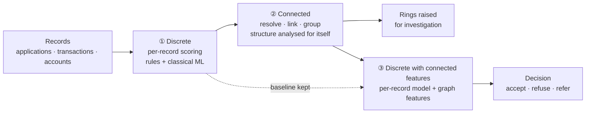
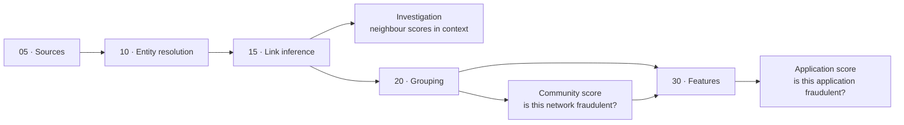
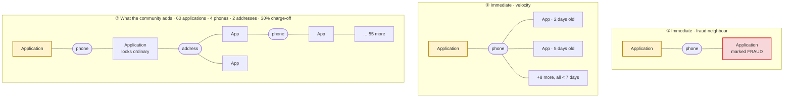

# Motivation

## Why a graph for fraud

Classical fraud detection scores one record at a time: this application, this transaction, this account. It is good at spotting *individually* anomalous behaviour and blind to *collectively* anomalous structure. Yet the expensive frauds are relational by construction:

- a **fraud ring** spreads a handful of addresses, phones and devices across dozens of applications, each of which looks perfectly ordinary on its own;
- a **mule network** has no existence outside the flow of money through a chain of accounts;
- a **synthetic identity** is, by definition, an identity with no history — its only tell is how its attributes are reused elsewhere.

A graph turns those connections into first-class data instead of a join nobody writes. The claim is worth stating narrowly: a graph does **not** replace per-record scoring, it adds a **structural** view that per-record scoring cannot express.

## Global vs local analysis

Where you sit determines what you are able to see at all.

| | **Global (network level)** | **Local (institution level)** |
|---|---|---|
| Who | card schemes and payment networks (Visa, Mastercard), interbank messaging (Swift) | a single bank or lender |
| Sees | flows across many institutions; the whole ring even when it spans several banks | only its own customers, applications and transactions |
| Blind to | intra-institution detail and KYC attributes it never receives | anything happening elsewhere — a cross-bank ring looks like unrelated applications |
| Consequence | detects cross-institution structures no single bank can see | must squeeze maximum signal out of a partial graph, and lean on shared or public reference data |

This repo mostly assumes the **local** case, because that is the usual engagement. The techniques are identical in the global case; the graph is simply bigger and the identifiers weaker.

## The overall pipeline: discrete → connected → discrete with connected features

The order in which you build matters more than the algorithms you pick.

1. **Discrete** — score each record on its own attributes: rules and classical ML, no graph. This is the baseline you must not throw away.
2. **Connected** — build the graph, resolve identifiers, infer links between applications, group them into communities. Analyse the structure for its own sake: this is where rings surface.
3. **Discrete with connected features** — feed graph-derived features back into the per-record model: community size, growth velocity, number of shared identifiers, centrality, distance to a known fraudster.

## The graph pipeline

### Two ways to use it: investigation vs data science

**Investigation** is the cheapest win, and usually the first thing an analyst asks for. Simply linking applications (steps `10` and `15`) puts **the scores you already produce in relation to each other**: this application shares a phone with two applications refused last month, this address appears on four applications filed in ten days with one already charged off, this account is two hops from a confirmed mule. No community score, no algorithm, no retrained model — only the links.

**Data science** aggregates graph metrics over the whole graph and feeds them to the model: community size, growth velocity, shared-identifier counts, centrality, distance to a known fraudster. It needs the full pipeline and pays off later, at scale.

| | **Investigation** | **Data science** |
|---|---|---|
| Audience | fraud analyst | modeller |
| Needs | the graph + existing scores | grouping, features, retraining |
| Gives | context and explanation, case by case | measurable lift, at scale |
| Pays off | immediately | once the pipeline is in place |

### Two things you can score

A graph pipeline can produces **two different scores**, answering two different questions. Both are legitimate.

| | **Community score** | **Application score** |
|---|---|---|
| Question | is *this network* fraudulent? | is *this application* fraudulent? |
| Unit scored | a community of applications / identities | one application (or transaction, account) |
| Typical output | a ring raised for investigation | accept / refuse / refer, at decision time |
| Consumer | fraud analyst, investigation queue | the decision engine, in-line |
| Latency | batch or near-real-time | real-time, per request |

Treat community scoring as a **second phase**: the links alone already carry most of the value, so put the graph and the application-level context in production first.
It then adds a **detection output** of its own (here is a ring, go look), plus **additional features** for the application score — this application joins a community that is dense, growing fast, and shares three phone numbers.

Three reads of the same graph make the difference concrete:

- **Immediate** — the application shares a phone with another application already marked as fraud. One hop, no computation: the link *is* the signal.
- **Immediate** — the application is attached to ten other applications all filed in the last seven days. Still one hop, still no algorithm, but now a velocity signal.
- **What the community adds** — the application has a *single* link, to one application that looks perfectly ordinary. Locally there is nothing to see. That link opens into a community of sixty applications sharing four phones and two addresses, with a 30% charge-off rate. No neighbour-level rule can reach that: it takes the whole connected component, and that is what a community score buys.

