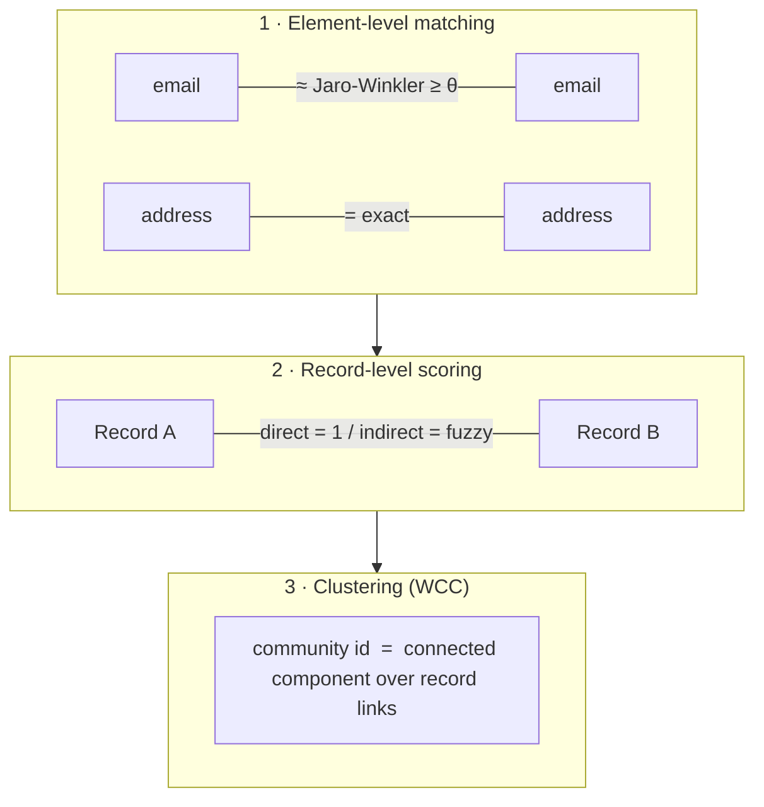

# 10 · Entity resolution

> Pipeline step 10 — link records that refer to the **same real-world entity** through shared or
> similar identity elements. The first thing to get right is a distinction that decides the whole
> design: **entity ≠ identity**, and for fraud you often should *not* consolidate the identity.

## Entity vs identity

These two words are used interchangeably in practice, but they describe different outputs:

| | **Entity resolution (linking)** | **Identity resolution (canonicalization)** |
|---|---|---|
| Output | *edges* between records that look like the same thing | *one* merged "golden record" per person/org |
| Persistent unit | the **community of records** | the **individual** |
| Typical goal | link analysis, fraud rings, deduplication signals | MDM, customer-360, single view of customer |
| Reversible? | yes — edges can be re-scored or dropped | no — a merge is destructive |

Classic record linkage has three steps: **match** (find pairs) → **cluster** (group) →
**canonicalize** (build the golden record). A graph fraud pipeline usually stops at **match →
cluster**. It never materializes the person; the unit that persists is the *community of records*,
not the *individual*.

This is a deliberate choice, not an omission — see below.

## Why you often should NOT consolidate identity for fraud

Canonicalization is crucial for MDM / customer-360, but for **link analysis and fraud** it adds
little and costs a lot. Keeping identity elements separate (resolving without merging) buys:

- **Explainability** — the analyst sees the *edges* that justify the grouping (`email ≈ email`,
  shared address, same phone). A merged node **destroys that evidence**.
- **Reversibility** — a bad merge is an **irreversible, self-amplifying** error (it pulls in more
  records, which pull in more…). Separate elements make a wrong link a cheap, local fix.
- **Incremental updates** — a **seeded** connected-components pass absorbs the daily arrival of new
  records without recomputing the world; a canonical entity would need constant re-merging.

In short: for detecting *networks*, the golden record buys accuracy you don't need and a failure
mode you don't want.

## The standard graph ER pipeline for fraud

The mainstream design links on **attributes**, takes connected components, then detects
communities. Concretely, two levels of matching feed one clustering step:

1. **Element-level matching** — link identity elements that are **equal or similar** (e.g.
   Jaro-Winkler on emails / addresses) above a threshold.
2. **Record-level scoring** — link records: **direct** (they share the *same* element node → score
   `1`) vs **indirect** (they reach each other *via similar* elements → a fuzzy score), aggregated
   into a global score.
3. **Clustering** — [Weakly Connected Components](../20-grouping/weakly-connected-component/) over
   the record links → a community id.

### Hard vs soft links

A useful refinement is to type the links by strength:

- **Hard links** — high-precision identifiers: phone, card, national ID.
- **Soft links** — noisy proxies: device, cookie, IP, fuzzy name/address.

Run connected components on **hard links** first → *super-nodes*, then build a **weighted graph of
soft links** between super-nodes and cluster that. This is exactly the *direct (score 1) /
indirect (fuzzy)* split plus the *super-node* notion — and reported detection coverage roughly
**doubles** versus a hard-links-only approach (see references).

## Is "no golden record" a known approach? Yes — it's mainstream

The triptych **link on shared/similar attributes → connected components → community detection** is
the standard fraud-ring pattern, in both industry and research:

- **AWS Entity Resolution + Neptune** — resolve on shared PII, then WCC + Louvain to isolate
  fraudulent clusters.
- **Fraud-ring graph detection** (industry) — connected components as a "first cut", then
  super-node pruning and community detection.
- **Heterogeneous link transformation** (Liu, 2025) — hard vs soft links, CC on hard links →
  super-nodes → weighted soft-link graph → clustering; ~2× detection coverage vs hard-only.

So stopping at *match → cluster* is neither exotic nor a shortcut — it is the mainstream line for
this use case.

## The main weakness: WCC alone = transitive closure

The real critique is not "no golden record" — it's that **pure WCC is transitive closure** above a
threshold, whose failure mode is the most documented problem in entity resolution:

- **Black-hole / monster / giant clusters** — a *single* weak link (a common address, a frequent
  name, a shared proxy) can agglomerate thousands of unrelated entities. See *Entity Matching in
  the Wild* (long transitive chains whose endpoints have nothing in common), the MapReduce org-ER
  "black hole" concept, and the field maxim: *never trust connected components blindly — watch the
  cluster-size distribution.*

The consistent research recommendation: **use CC to scale, then refine each component by density**:

- **Louvain / label propagation** (hierarchical record clustering, CC-MR + modularity),
- **correlation clustering** (Bansal–Blum–Chawla; MapReduce variants),
- **collective / relational clustering** (Bhattacharya & Getoor).

### Defenses, and what's usually missing

Good pipelines already **prune** the black-hole risk: score thresholds, anti-super-node caps (max
records per element), bucket-size limits, explicit `SuperNode` labels. That is exactly the
prescribed defense. What is typically **missing** is the **intra-component refinement**: today a
community *is* a connected component, so two genuinely separate networks joined by a **single** edge
blur into one.

## "Cluster vs golden record — what results?"

There is no clean benchmark, because the two answer **different questions**:

- Consolidation is judged on **cluster purity / pairwise F1** (ER precision).
- Network detection is judged on **ring coverage / precision**.

Transposed to a fraud pipeline:

- **Not consolidating does not degrade fraud detection.** What matters is *matching quality* +
  *clustering refinement*, not a canonical entity.
- **Over-consolidating actively hurts** (black holes). Stopping at the cluster is defensible; the
  lever for gains is **refinement + purity measurement**, not a golden record.
- The one blind spot of no canonical entity is **fragmentation**: the same individual split across
  two communities because a link fell below threshold. A canonical entity would recover it — at the
  cost of merge risk. Track fragmentation as the **symmetric metric** of the black hole.

## Recommendations

1. **Monitor the component size distribution** (p95 / p99) — this is the black-hole thermometer;
   run it first (feeds [`../80-monitoring/`](../80-monitoring/) daily community metrics).
2. **Evaluate intra-component refinement** (Louvain or correlation clustering) on the large
   communities, and measure whether it separates networks that are fused today.
3. **Treat fragmentation** (same identity, different communities) as the symmetric metric to the
   black hole.

## Going further

- Clustering the resolved links: [`../20-grouping/`](../20-grouping/) (WCC vs window-CC).
- Public reference & watchlist data to resolve against, and a note on paid resolution services:
  [`../05-sources/`](../05-sources/).

### References

- C. Liu — [*Fraud Detection Through Large-Scale Graph Clustering with Heterogeneous Link Transformation*](https://arxiv.org/abs/2512.19061) (arXiv, 2025) — hard/soft links, super-nodes via connected components, ~2× coverage.
- Y. Yan, S. Meyles, A. Haghighi, D. Suciu — [*Entity Matching in the Wild: A Consistent and Versatile Framework to Unify Data in Industrial Applications*](https://doi.org/10.1145/3318464.3386143) (SIGMOD 2020) — transitive-chain / black-hole failure of connected components.
- N. Bansal, A. Blum, S. Chawla — [*Correlation Clustering*](https://doi.org/10.1023/B:MACH.0000033116.57574.95) (Machine Learning, 2004).
- I. Bhattacharya, L. Getoor — [*Collective Entity Resolution in Relational Data*](https://doi.org/10.1145/1217299.1217304) (ACM TKDD, 2007) · [PDF](https://linqs.org/assets/resources/bhattacharya-tkdd07.pdf).
- AWS — [*Build fraud detection systems using AWS Entity Resolution and Amazon Neptune Analytics*](https://aws.amazon.com/blogs/database/build-fraud-detection-systems-using-aws-entity-resolution-and-amazon-neptune-analytics/) (shared PII → WCC + Louvain).
