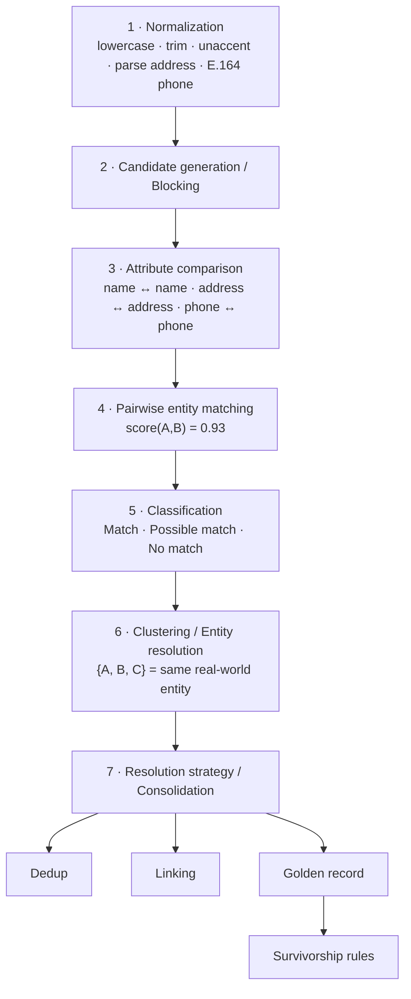

# 10 · Entity resolution

## The entity-resolution pipeline

1. **Normalization** — bring every field to a canonical form *before* any comparison: lowercase, trim, strip accents/punctuation, standardize casing, parse addresses into components, normalize phones to E.164, dates to ISO, etc. Skipping this makes every downstream step noisier — blocking misses candidates and comparisons under-score real matches.
2. **Candidate generation / Blocking** — the full pair space is `O(n²)` and unworkable. *Blocking* keeps only plausible pairs (same postcode, same soundex, same phone prefix, MinHash/LSH buckets). Everything downstream only ever sees these candidates.
3. **Attribute comparison** — for each candidate pair, compare fields against fields: `name ↔ name`, `address ↔ address`, `phone ↔ phone`. Each comparison yields a similarity (exact, edit distance, Jaro-Winkler, phonetic, geo-distance…).
4. **Pairwise entity matching** — aggregate the per-attribute similarities into a single pair score, e.g. `score(A, B) = 0.93` (weighted sum, Fellegi–Sunter, or a trained classifier).
5. **Classification** — turn the score into a decision with thresholds: **Match** / **Possible match** (clerical review) / **No match**.
6. **Clustering / Entity resolution** — pairwise matches are not transitive on their own; a clustering step groups them into entities: `{A, B, C} = same real-world entity` (connected components, correlation clustering, hierarchical…).
7. **Resolution strategy / Consolidation** — decide what to *do* with each cluster. Three options:
   - **Dedup (merge/purge)** — physically collapse the duplicates, keeping a single surviving row. **Destructive** at the record level: the redundant rows are gone.
   - **Linking** — keep every record as-is and only attach a shared entity/cluster id. No canonical record is built; fully **reversible**.
   - **Golden record** — **create a *new* canonical "best" record** and link all source records to it, field values arbitrated by **survivorship rules** (most recent, most trusted source, most complete…). Sources are **retained** (cross-referenced) → a *logical* merge, not a row deletion.

## For fraud: link the entities, don't merge them into an identity

For customer-360 the golden record *is* the deliverable. For **link analysis and fraud** it is mostly a **compute overhead with no added detection value**.

An *entity* is any resolvable node: an **identity** but also an **address**, a **phone**, a **device**. Steps 1–6 link records *through* those shared or similar entities; step 7 then takes the **Linking** branch — attach a shared cluster/entity id and keep every record separate and re-scorable. What it avoids is the **Golden record** branch: collapsing a cluster into a *single canonical identity* (one "person"). Linking the entities and merging them into an identity are two different goals — we want the first. The unit that persists is the *community of records*, never a materialized *individual*.

Why the golden record adds little here:

- **No detection gain** — fraud shows up in the *links* (shared phone, address, device) and in the *shape* of the community, already produced by steps 1–6. A canonical record reveals no ring you couldn't see from the links.
- **Extra, recurring cost** — the best record means re-running survivorship rules and re-materializing the canonical node **on every new arrival**; linking only adds an id/edge, and a **seeded** connected-components pass absorbs new records without recomputing the world.

And it is the **mainstream** choice, not a shortcut: *link on shared/similar attributes → connected components → community detection* is the standard fraud-ring pattern (AWS Entity Resolution + Neptune; industry fraud-ring detection; Liu 2025 — hard/soft links → super-nodes, ~2× coverage).

Further down the funnel, the two branches of step 7 answer different questions:

| | **Linking (entity resolution)** | **Golden record (identity resolution)** |
|---|---|---|
| Output | *edges* / shared cluster id between records | a *new* canonical record; sources kept & cross-referenced |
| Persistent unit | the **community of records** | the **canonical identity** |
| Typical goal | link analysis, fraud rings, dedup signals | MDM, customer-360, single view of customer |
| Survivorship rules? | not needed | required |
| Compute cost | cheap — an id/edge over existing data | extra pass: build the best record + re-run survivorship on every update |
| Value for fraud | high — the linking evidence stays visible | low — adds no detection power |

## Next Step

- **Link inference** — project these element-level matches into the application-to-application `SIMILAR` graph, handling the **super-node** problem: [`../15-link-inference/`](../15-link-inference/).