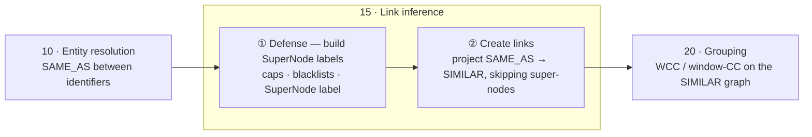

# 15 · Link inference

## Where we come from

Entity resolution (`10`) ran **per identifier type**: it decided which values are the same real-world identifier and linked them with `SAME_AS`:

- `phoneA —SAME_AS→ phoneB`, `addrA —SAME_AS→ addrB`, `ipA —SAME_AS→ ipB`, `emailA —SAME_AS→ emailB`, …

At this point nothing connects the **applications** — only their identifiers are resolved. Wiring the applications together, on the basis of those resolved identifiers, is exactly this step.

## Inferring application-to-application links

Each application points to its identifiers via `HAS`. We collapse the bipartite path (application → identifier → application) into a single application-to-application `SIMILAR` edge:

```
Application1 —HAS→ phoneA —SAME_AS→ phoneB ←HAS— Application2
                       ⇩  link inference
Application1 ——————————— SIMILAR ———————————→ Application2
```

Technically this is a **bipartite → monopartite projection** (applications ↔ identifiers, projected onto applications ↔ applications). Two flavors of edge, by strength:

- **Direct** — both applications point to the *same* identifier node → strong link, weight `1`.
- **Indirect** — they hold *similar* identifiers (joined by a fuzzy `SAME_AS`) → weaker, fuzzy weight.

We keep both applications separate and only add the edge (**Linking**); we never fuse them into one canonical identity (golden record). We are inferring *relationships* between distinct applications, not resolving them into one entity.

## The SuperNode problem

The single thing that wrecks link inference: **super-nodes** — an identifier shared by *thousands* of applications (a placeholder/default phone `0000000000`, a call-center number, a corporate/NAT IP like `127.0.0.1`, a shared device or cookie). Projecting links through it turns one junk value into a **clique of thousands of unrelated applications**.

Left unchecked, this is exactly what produces the classic failure mode downstream — the **black-hole / giant / monster component**, where a *single* weak link agglomerates thousands of unrelated dossiers (see *Entity Matching in the Wild*; the field maxim: *never trust connected components blindly — watch the cluster-size distribution*). In [`20-grouping`](../20-grouping/), WCC is transitive closure, so a single super-node edge fuses everything into one component.

Defenses — applied **here, at link time**, before the graph reaches clustering:

- **Anti-super-node caps** — do not project links through an identifier owned by more than *N* applications.
- **Blacklists** — known junk values (default/placeholder phones, `127.0.0.1`, test devices).
- **Explicit `SuperNode` label** — tag hub identifiers so they never propagate `SIMILAR` edges.
- **Score / weight thresholds** — inherit the classification cutoffs from `10`; drop weak fuzzy links.

The order matters: label the super-nodes **first**, then create the links, so no `SIMILAR` edge is ever drawn through a hub identifier.



## Link weight

Beyond simply drawing the link, it is possible — and useful — to attach a **weight** to each `SIMILAR` relationship.
Score and threshold are separate: link inference assigns each edge a score, while grouping later picks the threshold at which a link counts — so the cut can be retuned without recomputing scores.
Multiple ways to set the score:

- **Propagated from `SAME_AS`** — reuse the score already computed in step 10: an exact match gives `1`, a fuzzy one gives its similarity.
- **Combined from several identifiers** — when two applications share more than one identifier, aggregate the signals into a single weight. More shared identifiers → stronger link.

The **hard vs soft** split is just one weighting policy: **hard links** (high-precision identifiers — phone, card, national ID) get a high weight, **soft links** (noisy proxies — device, cookie, IP, fuzzy name/address) a low one. A common recipe is to infer on hard links first, then add a weighted layer of soft links on top and let clustering weigh them — reported to roughly **double** detection coverage versus a hard-links-only approach (Liu, 2025).

## Two opposite failure modes of the link threshold

The threshold / weight you choose here has two opposite failure modes, and **neither is visible until after grouping** — so the **component-size distribution** (p95 / p99) must be checked **regularly** as the earliest signal:

- **Too loose → over-merge.** Excess edges surface as giant, black-hole communities in [`20-grouping`](../20-grouping/) — painful to unwind once features and decisions depend on them.
- **Too strict → fragmentation.** A missing edge (a real match that fell below threshold) leaves the *same identity split across two communities*. Clustering can't fix this — it only groups existing edges — so the remedy is here, in link inference (looser threshold / better fuzzy match), never in grouping.

Splitting a component that a few *legitimate-but-weak* links fused is covered in [`20-grouping`](../20-grouping/) (**intra-component refinement**, via Louvain / label propagation / correlation clustering).

## Next Step

- Clustering the `SIMILAR` graph into communities: [`../20-grouping/`](../20-grouping/) (WCC vs window-CC), which also owns the over-merge / black-hole diagnosis and intra-component refinement.

### References

- C. Liu — [*Fraud Detection Through Large-Scale Graph Clustering with Heterogeneous Link Transformation*](https://arxiv.org/abs/2512.19061) (arXiv, 2025) — hard/soft links, super-nodes via connected components, ~2× coverage.
- Y. Yan, S. Meyles, A. Haghighi, D. Suciu — [*Entity Matching in the Wild: A Consistent and Versatile Framework to Unify Data in Industrial Applications*](https://doi.org/10.1145/3318464.3386143) (SIGMOD 2020) — transitive-chain / black-hole failure of connected components.
- N. Bansal, A. Blum, S. Chawla — [*Correlation Clustering*](https://doi.org/10.1023/B:MACH.0000033116.57574.95) (Machine Learning, 2004).
- I. Bhattacharya, L. Getoor — [*Collective Entity Resolution in Relational Data*](https://doi.org/10.1145/1217299.1217304) (ACM TKDD, 2007) · [PDF](https://linqs.org/assets/resources/bhattacharya-tkdd07.pdf).
- AWS — [*Build fraud detection systems using AWS Entity Resolution and Amazon Neptune Analytics*](https://aws.amazon.com/blogs/database/build-fraud-detection-systems-using-aws-entity-resolution-and-amazon-neptune-analytics/) (shared PII → WCC + Louvain).
