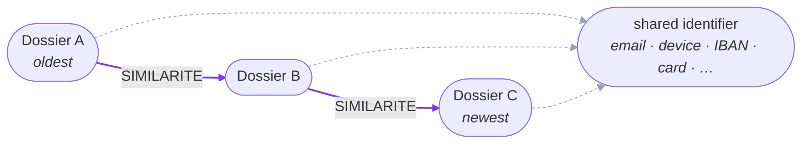
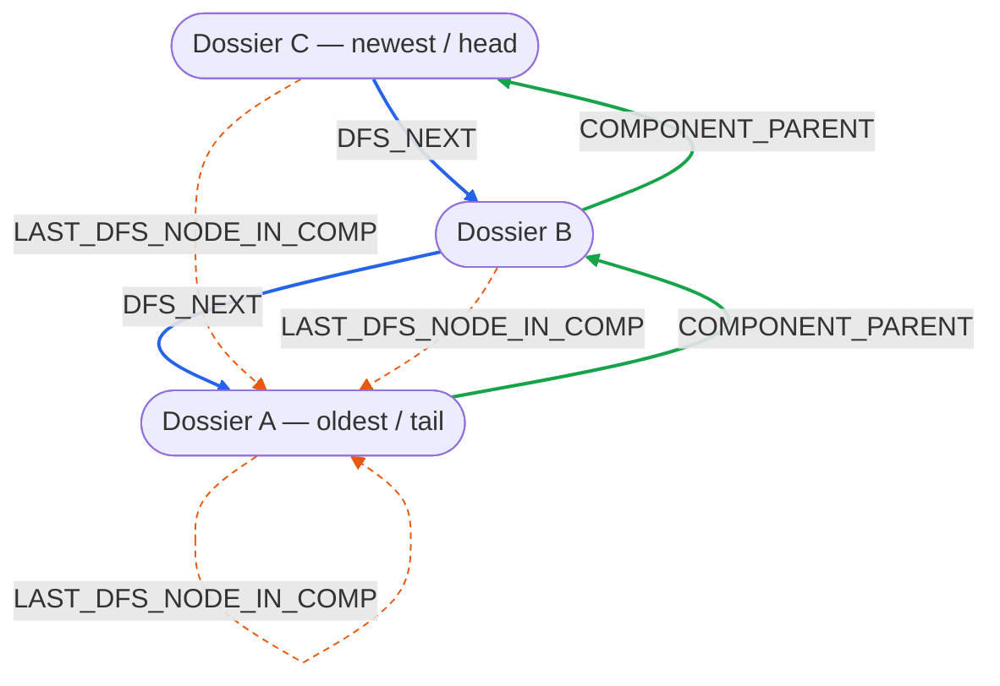

# Fraud detection with temporal communities

> **Note:** the runnable notebook chain (`01`–`04`), `credit_fraud_app.py` and
> `demopit_verification.ipynb` have moved to
> [`../windows-connected-component/upper/dfs-next/`](../windows-connected-component/upper/dfs-next/).
> This folder keeps the original write-ups (`window_cc_and_bridge_cutting.md`,
> `mode_etude_dfs.md`) for reference.

Detect credit-application fraud by looking at the **community** a `Dossier` belongs to — the set of applications that share a strong identifier (email, device, card, IBAN, …). Fraud rings reuse identifiers, so a community's shape and activity are strong signals.

The key idea is **point-in-time**: at any date we can rebuild a community using **only the past**, so features and training never leak the future.

## How it works

Two `Dossier` nodes that share an identifier are linked (`SIMILARITE`). On top of this graph we materialize a few relationships that make time-travel queries cheap:

**1. Membership** — dossiers that share an identifier form a community, chained by date via `SIMILARITE`:

- **`SIMILARITE`** / identifier links define *who* is in a community.



**2. Temporal structure** — on top of `SIMILARITE`, `02_build_relations.ipynb` materializes three relationships **in this order** (cells 3 → 4). Each step replays in batch what production maintains atomically for every new dossier:

1. **`COMPONENT_PARENT`** (green, oldest → newest) — a time-oriented union-find forest. Inside each `SIMILARITE` component, dossiers are processed by ascending `DATE_COMMANDE`; each new dossier is attached to the **current head** of its community (the end of the existing chain reachable from an older, similar dossier). Since every merge points forward in time, the node with **no outgoing** `COMPONENT_PARENT` is the current head (newest), and walking the chain answers *"which community/head existed at date X?"*.
2. **`DFS_NEXT`** (blue, newest → oldest) — a pre-materialized linked list of a community's members. A DFS is run from each head over the **reversed** forest, and consecutive visited nodes are linked. This turns *"enumerate every member of a community"* into a single linear traversal instead of a repeated graph search — hence the opposite direction to `COMPONENT_PARENT`.
3. **`LAST_DFS_NODE_IN_COMP`** (orange) — the end-of-chain marker. For (almost) every node it points to the last node reachable along its `DFS_NEXT` chain (the tail / oldest member; a **self-loop** for singletons). It **bounds** the traversal: a point-in-time query starting at dossier *d* follows `DFS_NEXT` only up to *d*'s marked tail, reconstructing the community exactly as it stood on *d*'s date — no future members leak in.



From there we compute time-weighted features per application (`IND_COM_TAILLE`, `IND_COM_NB_DDE_7J/7M/1AN`, `IND_COM_NB_TOP_FRAUDE_DDE_*`) and train a model **walk-forward** (advancing a cutoff date day by day) to check that it actually learns over time.

## Prerequisites

- A running **Neo4j** instance with the **GDS** (Graph Data Science) library installed.
- A database named **`fraudwcctemporal`** (the default used by all notebooks and the app). Update the `NEO4J_URI` / `NEO4J_USER` / `NEO4J_PASSWORD` constants at the top of each file to match your instance.
- Python 3.10+.

## Usage

Run the notebooks in order:

1. **`01_setup_ingestion.ipynb`** — generates and ingests synthetic demo data (`Dossier` + identifiers). *Demo only*; in production this graph already exists.
2. **`02_build_relations.ipynb`** — builds `SIMILARITE` then the temporal structure (`COMPONENT_PARENT` / `DFS_NEXT` / `LAST_DFS_NODE_IN_COMP`).
3. **`03_training_walkforward.ipynb`** — computes point-in-time features and runs the walk-forward training / learning curves.

Then explore visually with the Streamlit app:

```bash
pip install streamlit streamlit-agraph
streamlit run credit_fraud_app.py
```

It lets you pick an application and see its community **before / at / after** the application date, along with its properties and evolution vector.

## Credits

The point-in-time WCC traversal logic (rebuilding a component as it existed at a given date via `COMPONENT_PARENT` / `DFS_NEXT` / `LAST_DFS_NODE_IN_COMP`) is based on [halftermeyer/point-in-time-wcc-neo4j-model](https://github.com/halftermeyer/point-in-time-wcc-neo4j-model).
