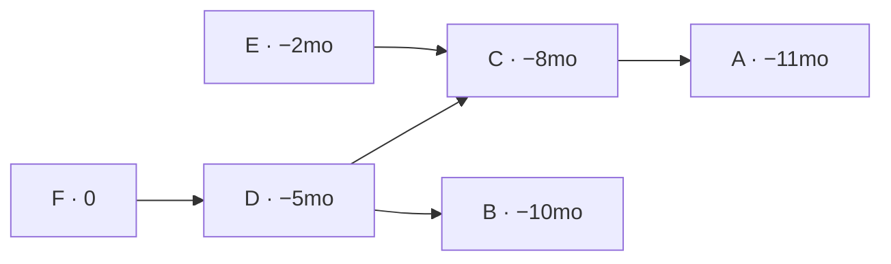
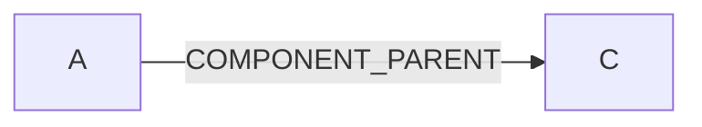
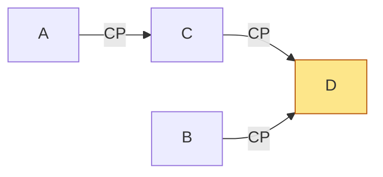
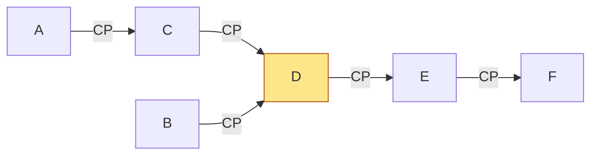
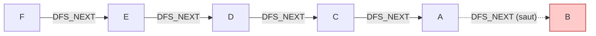
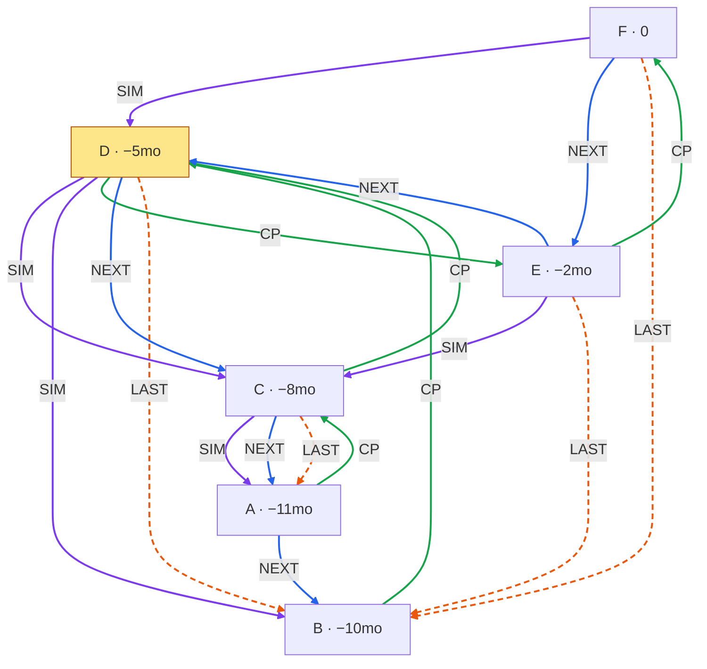
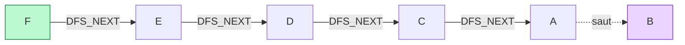
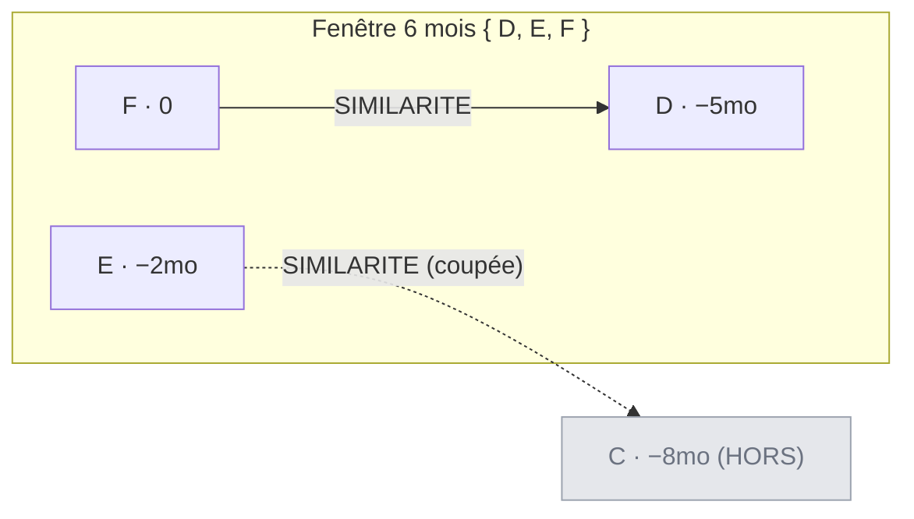
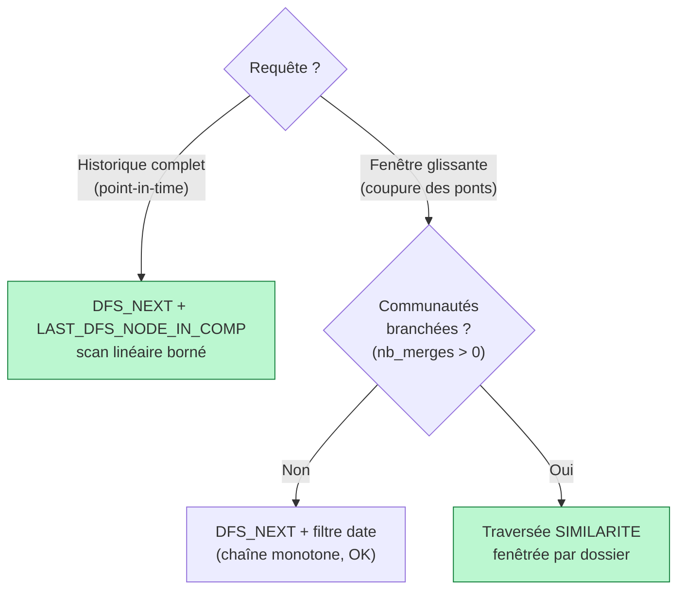

# MODE ÉTUDE — le même process avec notre système DFS

Ce document rejoue **l'exemple client** (écran « MODE ÉTUDE », logique `SAME_CC_AS`) mais avec **notre** structure : `SIMILARITE` + `COMPONENT_PARENT` + `DFS_NEXT` + `LAST_DFS_NODE_IN_COMP`.

Objectif du client : *pour chaque dossier, calculer les indicateurs réseau **sans utiliser l'information future*** (point-in-time). Deux vues :

1. **Réseau « dernière année »** (1 an glissant) — le tableau `A:0, B:0, C:1, D:3, E:4, F:5`.
2. **Réseau « 6 derniers mois »** (6 mois glissants) — le cas piège : pour `F`, la bonne réponse est `1 (D)`, et le chaînage naïf `SAME_CC_AS` donne `2 (D,E)` ❌.

On montre que **notre DFS reproduit exactement le tableau 1 an**, puis qu'il **tombe dans le même piège** que le `SAME_CC_AS` sur la fenêtre 6 mois — et pourquoi, et comment corriger.

---

## 0. Un jeu d'arêtes concret, cohérent avec les chiffres du client

Le client donne des comptes, pas les arêtes brutes. Voici un jeu d'identifiants partagés qui **reproduit exactement ses deux tableaux** (dates relatives à `F = aujourd'hui`) :

| Dossier | Date (relative) | Dans la fenêtre 6 mois de F ? |
|---|---|---|
| A | −11 mois | non |
| B | −10 mois | non |
| C | −8 mois  | **non** (le pont critique) |
| D | −5 mois  | oui |
| E | −2 mois  | oui |
| F | 0        | oui |

Identifiants partagés (⇒ arêtes `SIMILARITE`, reliant les dossiers **consécutifs** d'un identifiant, **récent → ancien** — convention du client) :

- `id1` partagé par **A, C, E** → `E→C`, `C→A`
- `id2` partagé par **B, D, F** → `F→D`, `D→B`
- `id3` partagé par **C, D** → `D→C`

### Graphe `SIMILARITE` (les vraies arêtes, récent → ancien)



> C'est le graphe « client équivalent » : deux dossiers reliés = ils partagent un identifiant. Tout le reste (`COMPONENT_PARENT`, `DFS_NEXT`) n'est qu'une **structure d'accélération** construite par-dessus.
>
> ⚠️ **Convention de sens** : ici `SIMILARITE` pointe **récent → ancien** (comme le client). *Notre code actuel fait l'inverse (ancien → récent) — à corriger plus tard.* Le sens est **sans effet** sur `COMPONENT_PARENT` / `DFS_NEXT` / `LAST` : seule la **connectivité** (non orientée) compte, donc les communautés et les comptes sont identiques dans les deux sens.

---

## 1. Construction de `COMPONENT_PARENT` (union-find temporel), pas à pas

Règle : on traite les dossiers **par date croissante** ; chaque nouveau dossier se rattache à la **tête courante** (nœud sans `COMPONENT_PARENT` sortant) de chaque composante qu'il touche via `SIMILARITE`.

**A arrive** — seul. Tête = `A`.
**B arrive** — pas de similaire présent (`B~D` est dans le futur). Seul. Tête = `B`.

**C arrive** — `C~A`. Se rattache à la tête de la compo de A (`A`).



**D arrive** — `D~B` **et** `D~C`. Il **fusionne** deux composantes séparées (`{A,C}` de tête `C`, et `{B}` de tête `B`). ⇒ **nœud de fusion** (in-degree 2).



**E arrive** — `E~C` ; la tête de la compo de C est maintenant `D`. ⇒ `D→E`.
**F arrive** — `F~D` ; la tête de la compo de D est maintenant `E`. ⇒ `E→F`.

### Forêt `COMPONENT_PARENT` finale



> ⚠️ Point capital : l'arête `E→F` ne veut **pas** dire « E et F partagent un identifiant ». Elle veut dire « F s'est rattaché à la **tête** E de la composante qu'il a rejointe (via son vrai lien `F~D`) ». `COMPONENT_PARENT` encode un **chaînage par tête**, pas les vraies arêtes. On y revient au §4 — c'est **toute** la subtilité du slide client.

---

## 2. Construction de `DFS_NEXT` + `LAST_DFS_NODE_IN_COMP`

Un DFS part de la tête `F` sur la forêt **inversée** (`F←E←D←{C,B}`, `C←A`) et relie les nœuds **consécutivement visités**.

Ordre de visite : `F, E, D, C, A, B` (on descend `D→C→A`, backtrack, puis `B`).

### Liste chaînée `DFS_NEXT`



> Le maillon `A → B` est un **saut vers un dossier plus récent** (A = −11mo, B = −10mo) : c'est le backtrack du DFS au niveau du branchement `D`. La liste chaînée reste complète (`n−1` maillons) mais **n'est pas monotone en date**.

### Marqueurs `LAST_DFS_NODE_IN_COMP` (fin du sous-arbre de chaque nœud)

| Nœud | Son sous-arbre (via DFS_NEXT) | `LAST` |
|---|---|---|
| F | F,E,D,C,A,B | **B** |
| E | E,D,C,A,B | **B** |
| D | D,C,A,B | **B** |
| C | C,A | **A** |
| A | A | **A** |
| B | B | **B** |

### Vue consolidée des 3 relations (DFS `F → E → D → C → A → B`)

<span style="color:#7c3aed">■</span> `SIMILARITE` (vraies arêtes) &nbsp;·&nbsp; <span style="color:#16a34a">■</span> `COMPONENT_PARENT` &nbsp;·&nbsp; <span style="color:#2563eb">■</span> `DFS_NEXT` &nbsp;·&nbsp; <span style="color:#ea580c">▪</span> `LAST_DFS_NODE_IN_COMP` (pointillés)



> Auto-boucles `LAST` omises pour la lisibilité : `A → A` et `B → B` (feuilles, `LAST` = soi-même).

Lecture :

- **`SIMILARITE`** (violet, **récent → ancien**) = les **vraies arêtes** (identifiants partagés) : `F→D, E→C, D→C, D→B, C→A`. C'est la seule relation qui reflète la connectivité réelle — les 3 autres en sont dérivées. (Sens à la convention client ; l'inverser ne change rien aux relations dérivées.)
- **`COMPONENT_PARENT`** (vert) pointe **ancien → récent** vers la tête `F`. `D` (jaune) a **deux entrantes** (`C→D`, `B→D`) : c'est le **nœud de fusion**. Noter que `COMPONENT_PARENT` **diffère** de `SIMILARITE` : ex. `E→F` (chaînage de tête) alors que le vrai lien de F est `F→D`.
- **`DFS_NEXT`** (bleu) suit l'ordre du DFS `F→E→D→C→A→B`. Le maillon **`A → B` est le saut** (A = −11mo → B = −10mo, on remonte dans le temps) : conséquence directe du branchement en `D`.
- **`LAST_DFS_NODE_IN_COMP`** (orange pointillé) : `F, E, D → B` (queue de leur sous-arbre) et `C → A` ; feuilles `A`/`B` pointent sur elles-mêmes. C'est ce qui **borne** chaque parcours point-in-time.

---

## 3. Vue « dernière année » : notre DFS reproduit le tableau client ✅

Pour un dossier `d`, sa communauté point-in-time = on suit `DFS_NEXT` depuis `d` **jusqu'à son marqueur** `LAST(d)` (bornage = pas de fuite du futur), puis on filtre les membres à ≤ 1 an.

**Exemple, F** : `F → E → D → C → A → B`, on s'arrête sur `LAST(F)=B`. Membres (hors F) = `{E, D, C, A, B}`.



En appliquant la même règle à chaque dossier :

| Dossier | Parcours `DFS_NEXT` borné | Réseau (hors soi) | Client |
|---|---|---|---|
| A | A | ∅ → **0** | 0 ✅ |
| B | B | ∅ → **0** | 0 ✅ |
| C | C → A | {A} → **1** | 1 (A) ✅ |
| D | D → C → A → B | {C,A,B} → **3** | 3 (A,B,C) ✅ |
| E | E → D → C → A → B | {D,C,A,B} → **4** | 4 (A,B,C,D) ✅ |
| F | F → E → D → C → A → B | {E,D,C,A,B} → **5** | 5 (A,B,C,D,E) ✅ |

> **Identique au tableau du client.** Et c'est plus efficace : un **scan linéaire** de liste chaînée borné par le marqueur, au lieu d'une traversée d'arbre `*` re-développée à chaque requête. Sur ce cas « historique complet », `DFS_NEXT` est correct **même avec le branchement** (le marqueur suit le **sous-arbre = connectivité**, pas le temps).

---

## 4. Vue « 6 derniers mois » : le piège (le même que le client)

Fenêtre de F : `[−6mois, 0]` → seuls **D, E, F** sont dedans. **A, B, C sont dehors** (C = −8mo est le pont critique).

### 4.a — Le raccourci naïf `DFS_NEXT` + filtre date : **FAUX** ❌

On parcourt `DFS_NEXT` depuis F et on coupe au bord de la fenêtre :

```
F(0) → E(−2) → D(−5) → C(−8, HORS) → stop
```

Membres dans la fenêtre = `{E, D}` → **2 (D, E)**.

C'est **exactement** le `2 (D,E)` ❌ du slide client (« Avec SAME_CC_AS »). Pourquoi ? Parce que `DFS_NEXT` enfile `F → E → D`, plaçant `E` **avant** `D`, alors qu'en réalité :

- le vrai lien de F est `F~D` (via `id2`) ;
- le seul lien de E est `E~C` (via `id1`), et **C est hors fenêtre**.

`DFS_NEXT` (comme `COMPONENT_PARENT`) a **remplacé la vraie arête `F~D` par le chaînage de tête `F→E→D`**. Dès qu'on branche + fenêtre, ce chaînage ment.

### 4.b — La bonne réponse : connectivité `SIMILARITE` dans la fenêtre ✅

On recalcule la composante connexe de F **sur les vraies arêtes `SIMILARITE`**, restreinte aux nœuds de la fenêtre :



- `F~D` : les deux dans la fenêtre → **D compte**.
- `E~C` : `C` est hors fenêtre → le lien de E est **coupé** → **E ne compte pas** (E est isolé dans la fenêtre).

Résultat : réseau de F sur 6 mois = `{D}` → **1 (D)** ✅. C'est le `1 (D)` ✅ (« Sans SAME_CC_AS ») du client.

---

## 5. Conclusion — le parallèle exact avec le message du client

Le client écrit : *« Il faudrait adapter `SAME_CC_AS` à chaque dossier. »* Notre diagnostic est le même, transposé à notre structure :

| Cas d'usage | Bonne structure | Pourquoi |
|---|---|---|
| **Historique complet** point-in-time (tableau 1 an) | `DFS_NEXT` + `LAST_DFS_NODE_IN_COMP` | scan linéaire borné, correct même sous branchement (suit le sous-arbre) |
| **Fenêtre glissante + coupure des ponts** (tableau 6 mois) | **`SIMILARITE` fenêtré** (vraies arêtes) | `DFS_NEXT`/`COMPONENT_PARENT` chaînent par **tête**, pas par vraie arête → faux dès qu'il y a une **fusion** |

Autrement dit :

- `DFS_NEXT` reste le bon outil pour la vue « tout le passé » (rapide, correct).
- Pour la **fenêtre glissante**, aucun raccourci sur la liste chaînée ne marche sous branchement — parce que « retirer C et voir qui reste connecté à F » est une propriété de **graphe**, que ni l'ordre DFS ni l'ordre date ne capturent. Il faut **rejouer la connectivité `SIMILARITE` par dossier**, dans la fenêtre.
- Garde-fou pratique : si `COMPONENT_PARENT` ne branche pas (`nb_merges = 0`, cas des communautés **linéaires**), alors `DFS_NEXT` **est** ordonné par date et le raccourci « walk + skip » redevient correct. Sinon → fallback `SIMILARITE`.


