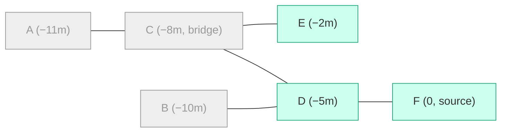

# Window-CC and Bridge-Cutting for Temporal Fraud Communities

*How to bound a fraud community by time on **both** ends — and which of our existing
structures (`SAME_CC_AS` / `COMPONENT_PARENT`, `DFS_NEXT`) can (and cannot) do it.*

---

## 1. The concept: a **window connected component** (window-CC)

When we score a dossier/event at instant `T`, its "community" should be bounded by
**two** time boundaries, not one:

```
                 back boundary                     front boundary
                 (lower bound)                     (upper bound)
   ────────────────┃──────────── window ────────────┃────────────▶ time
                 T − Δ                               T
                          (Δ = e.g. 6 months)
```

The set of events connected to the source **using only nodes/edges inside `[T − Δ, T]`**
is a *window connected component* (**window-CC**) — a named, studied object in the
temporal-graph literature
([Ma et al., SIGMOD 2023](https://chenhao-ma.github.io/papers/SIGMOD23temporalCC.pdf);
[VLDB Journal 2026](https://dl.acm.org/doi/10.1007/s00778-026-00977-5)).

The two boundaries play very different roles.

### 1.A Front boundary (upper bound `date ≤ T`): **leak-safe — proven**

Keep only information available at `T`. A plain WCC over the *full* graph would let an
event inherit structure created by **future** events, i.e. *future leakage*: offline
metrics inflate, then collapse in production.

This half is well established and is exactly what our current model already solves via the
temporal forest (`COMPONENT_PARENT` ≡ the client's `SAME_CC_AS`) and its `DFS_NEXT`
materialization:

- ["No Peeking Ahead" (Towards Data Science)](https://towardsdatascience.com/no-peeking-ahead-time-aware-graph-fraud-detection/) — filtering to `≤ t` gives ~2–3× lift on top deciles; the undirected/leaky variant inflates scores artificially.
- ["Leakage-Safe Graph Features…" (arXiv 2603.06632)](https://arxiv.org/pdf/2603.06632) — structural features on the historical subgraph `G≤t`, ROC-AUC ≈ 0.85 on Elliptic under a strict temporal split.
- [ATLAS, Capital One (arXiv 2509.20339)](https://arxiv.org/pdf/2509.20339) — serve-time, non-anticipative connectivity in production: **+6.38% AUC, −50% friction**.
- [Neo4j temporal-graph model](https://neo4j.com/blog/developer/mastering-fraud-detection-temporal-graph/) — the `SAME_CC_AS` forest we build on.

### 1.B Back boundary (lower bound `date ≥ T − Δ`): **bridge-cutting — not proven, but motivated**

The client additionally wants to **ignore old connections**: if the *only* link between
the source and an older event passes through a node **outside** the window, that link is
**severed**. This lower-bound severance is **bridge-cutting**.

State of the evidence:

- **No published study isolates bridge-cutting and proves a detection lift.** window-CC is
  defined and optimized for *query efficiency* (SIGMOD23 / VLDB26) and is *motivated* by
  fraud (money-transfer cycles), but never validated as an ML-accuracy gain. ATLAS uses a
  different mechanism (an **edge-recency** window on a GNN, not a component recompute) and
  its ablation shows **larger** windows are **better** — so it gives no support for
  aggressive cutting.
- **What *is* proven:** windowed **acceleration / velocity / burstiness** statistics are
  among the most predictive temporal features
  ([credit-fraud temporal study](https://scipublication.com/index.php/AIMLR/article/download/209/192):
  transaction *velocity* is the single most predictive temporal feature, ~28.4% of temporal
  performance; ATLAS and TGN lines of work rely on burstiness; the Neo4j model computes
  `component_velocity`). Computing an acceleration such as
  `accel = (nb_7d / 7) / (nb_30d / 30)` **requires a well-defined windowed community**.

> **Takeaway.** Bridge-cutting is a **business-driven, principled definition** of "the
> community *inside* the window". Even without a direct proof, it underpins windowed
> statistics that *are* proven relevant. Treat its incremental lift as a hypothesis to
> **validate on the client's own data**, not as an established fact.

---

## 2. Why our existing structures are **not** enough for bridge-cutting

Bridge-cutting must **re-evaluate connectivity inside the window**. The temporal overlay
cannot do that on its own.

### 2.A `SAME_CC_AS` / `COMPONENT_PARENT` is not enough

The union-find forest is **chronologically oriented** (old → new, out-degree ≤ 1). It
answers *"as of date D"* by walking **forward** and stopping at the latest head `≤ D` — an
**upper bound only**. It has **no way to drop an old interior member**: removing such a node
can *split* the component, and a forward-merge forest simply cannot represent that split.

This is precisely the client's objection: `SAME_CC_AS` **keeps prior connections**. It is
the right tool for 1.A, the wrong tool for 1.B.

### 2.B The `DFS_NEXT` solution does not work either

`DFS_NEXT` is a cumulative linearization of the component (a linked list from the head
through **all** members). It is **not date-monotone across merges**: after a merge the chain
jumps between lineages. Filtering the chain by date therefore returns members that are
inside the window **but disconnected from the source once the bridge is removed**.

**Worked example (A–F, reproduced in `demopit_verification.ipynb`):**



Evaluate **F** with a 6-month window (keeps `D, E`; drops `A, B, C`):

| Method | Result | Correct? |
| --- | --- | --- |
| Naïve `DFS_NEXT` chain + date filter | `{D, E}` → **2** | ❌ E only reaches F **through C**, which is outside the window |
| Bridge-cut (re-evaluate connectivity in window) | `{D}` → **1** | ✅ |

So `DFS_NEXT` is perfect for the leak-safe **upper** bound (§1.A) and useless for the
bridge-cut **lower** bound (§1.B).

---

## 3. Solutions

**Common frame.** For a source scored at `T`, we always start from its **leak-safe scope**
given by the existing temporal structure (`COMPONENT_PARENT` / `SAME_CC_AS` walk, or the
`DFS_NEXT` chain — both implicitly bounded by `date ≤ T`), then apply bridge-cutting
**inside** the window. We **store only the resulting features** on the node, not the
community itself.

**Notation (per community / per source):**

| Symbol | Meaning |
| --- | --- |
| `C` | size of the leak-safe (as-of) community of the source |
| `W` | in-window members (`date ∈ [T−Δ, T]`), `W ≤ C` |
| `E_W` | `SIMILARITE` edges among the `W` in-window members |
| `W_s` | size of the source's **bridge-cut** piece, `W_s ≤ W` |
| `N` | number of events in the community (feature build touches each once) |

### 3.A — Collect `DFS_NEXT` + date filter → WCC → features  *(the proposed baseline)*

1. Walk the source's `DFS_NEXT` chain to the `LAST_DFS_NODE_IN_COMP` marker → the leak-safe
   community `C` (upper bound handled, §1.A).
2. Filter members to the window → `W` in-window nodes.
3. Recompute **WCC on the `SIMILARITE` edges among those `W` nodes** (bridge-cutting).
4. Keep the sub-component containing the source, compute the windowed features on it.

**Complexity (per event):** `O(C)` chain walk + `O(W + E_W)` WCC (union-find, ~linear).
**Over a community:** `O(N · (C + E_W))` worst case.

- ➕ Reuses `DFS_NEXT`; one WCC yields **all** windowed sub-components at once (reusable for
  every member that shares the same cutoff).
- ➖ Recomputes a WCC per event because the window **slides** with each `T`; materializes the
  whole windowed subgraph even though only the source's piece is needed; a GDS projection per
  event adds overhead (or use a Cypher/APOC WCC).

### 3.B — Bounded `SIMILARITE` traversal from the source, **no WCC**  *(recommended)*

Instead of rebuilding the whole windowed subgraph and then extracting the source's piece,
**traverse `SIMILARITE` outward from the source**, keeping only nodes inside the window. The
reached set **is** the source's bridge-cut window-CC — directly.

```cypher
:param nodos => "F"

CYPHER 25
MATCH (f:Dossier {NODOS:$nodos})
WITH f, f.DATE_COMMANDE AS T, f.DATE_COMMANDE - duration({months:6}) AS win
MATCH (f)(()-[:SIMILARITE]-(n:Dossier
        WHERE n.DATE_COMMANDE >= win AND n.DATE_COMMANDE <= T)){1,}(m:Dossier)
WITH DISTINCT m WHERE m.NODOS <> $nodos
RETURN collect(m.NODOS) AS window_component   // bridge-cut, exact
```

Leak-safety is **built in** by the `n.DATE_COMMANDE <= T` predicate; bridge-cutting by the
`>= win` predicate. (`COMPONENT_PARENT` can still be used first to pre-scope the traversal to
the leak-safe community, but the date predicate alone already guarantees both bounds.)

**Complexity (per event):** `O(W_s + E_{W_s})` — only the source's reachable piece, no
projection, no global WCC. Always `≤` 3.A.

- ➕ Cheapest; exact; **pure Cypher**; computes only what is needed; naturally per-event
  (matches the sliding window / walk-forward).
- ➖ One traversal per event (inherent to a per-event sliding window); if you need **every**
  member's component at a **shared** cutoff, 3.A's single WCC amortizes better.

### 3.C — Fixed-cutoff / bucketed community WCC  *(amortized, for monitoring)*

For a **fixed** cutoff `D` (e.g. month-end buckets), project the community's `SIMILARITE`
edges within `[D − Δ, D]`, run **one** WCC, label every node's window-component, and compute
features for **all** members at once.

**Complexity:** `O(W + E_W)` **once** per `(community, bucket)`, amortized over all members
scored at that bucket.

- ➕ Best amortization for periodic scoring / monitoring at a common date.
- ➖ **Approximate** for training: the window is aligned to the bucket, not to each event's
  exact `T`, so it is only leak-safe-exact if `bucket == event` granularity.

### 3.D — Maintained window-CC index  *(advanced, scale-only)*

The DB literature builds **maintainable indices** answering window-CC queries in
near-`polylog` time with incremental updates
([SIGMOD 2023](https://chenhao-ma.github.io/papers/SIGMOD23temporalCC.pdf),
[VLDB 2026](https://dl.acm.org/doi/10.1007/s00778-026-00977-5)). This is the principled path
if volumes ever explode — **not** a link-cut tree inside GDS (GDS has no dynamic
connectivity). **Overkill at the client's current scale.**

### Feasibility at the client's scale

The five largest communities are **5802, 678, 416, 377, 365** dossiers. A WCC over a few
thousand `SIMILARITE` edges runs in **milliseconds**; a 6-month slice is even smaller. Even
3.A over the 5802-member community (worst case `~N·(C+E)`) completes in **seconds**, and 3.B
is strictly cheaper. Storage stays minimal — we persist **features only**.

> **Note on the 5802 community.** A single giant component on a background where everything
> else is `< 700` is almost always an **over-merge** (a garbage identifier such as a default
> phone/IP/device, or a long chain of bridges). Bridge-cutting on a 6-month window is
> precisely the mechanism that should **shatter** it into realistic pieces — *unless* the glue
> is one identifier active continuously across every sub-window, in which case the fix is to
> **blacklist that identifier**, not to window. Diagnose *what* holds it together before
> concluding.

### Recommendation

| Solution | Exact? | Per-event cost | Storage | Best for |
| --- | --- | --- | --- | --- |
| 3.A DFS collect + WCC | ✅ | `O(C + W + E_W)` | features | reuse of `DFS_NEXT`; shared-cutoff batches |
| **3.B bounded `SIMILARITE`** | ✅ | `O(W_s + E_{W_s})` | features | **walk-forward training + inference** |
| 3.C bucketed WCC | ≈ | `O(W+E_W)` amortized | comp-id or features | periodic monitoring |
| 3.D window-CC index | ✅ | ~polylog | external index | extreme scale |

**Default: 3.B** — exact, cheapest, leak-safe by construction, per-event. Keep `DFS_NEXT`
for the cumulative leak-safe features (§1.A). Then, because §1.B is not proven, **validate**
with a 3-way walk-forward ablation of the *same* feature:

1. cumulative as-of (`DFS_NEXT`) — today's baseline,
2. recent members inside the window (naïve age filter),
3. window-CC **bridge-cut** (3.B).

Equal AUC/AP ⇒ bridge-cutting is a definition preference; a lift ⇒ empirical proof on the
client's own data — the only proof currently available.
