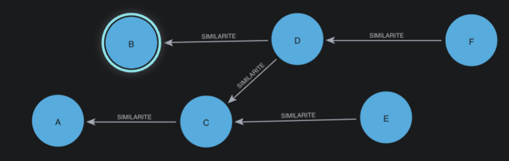

# Upper + lower bound — leak-safe **and** bridge-cut

> Keep the upper bound (`date ≤ T`) and add a **lower** bound (`date ≥ T − Δ`): if the *only*
> link between the source and an older dossier passes through a node **outside** the window,
> that link is **severed**. This lower-bound severance is **bridge-cutting**.

## What the lower bound is really for

The lower bound exists to **shrink the community**. The hypothesis: some **old connections are
no longer relevant** and we do not want to count them. Concrete cases:

- a **phone number that changed owner** — the old dossiers linked through it are now a *different*
  person;
- an **address left behind after a move** — dossiers glued by the previous address no longer
  reflect the same household.

Cutting links that survive **only** through out-of-window nodes removes this stale glue, so the
source's community reflects its **recent, still-relevant** neighborhood rather than its entire
history.

This is **under study** — bridge-cutting is only *one* way to encode that intent. Alternatives we
could have chosen (and may still evaluate):

- **quantify the graph**: measure centrality / degree growth and flag a community that turns
  *tentacular* over time — often a symptom of over-merge (a garbage identifier) rather than a
  genuine fraud ring;
- **temporal clustering**: re-cluster the community across time (e.g. **Leiden**) and keep only
  the source's current cluster.

> **When you do *not* need the lower bound.** Counting the *last X dossiers over time* (`n_7d`,
> `n_30d`, `n_1y`, `accel = (n_7d/7) / (n_30d/30)`) needs only the **upper** bound
> ([`../upper/`](../upper/)) **+ a date filter in Cypher** — no bridge-cut recompute, and it is
> **more performant**. Use the lower bound only when you specifically want to **sever** stale
> connectivity, not merely to count recent activity.

## Status

Bridge-cutting is a **business-driven, principled** definition of "the community *inside* the
window". No published study isolates it and proves a detection lift on its own — but the windowed
statistics it enables (velocity, acceleration, burstiness) *are* proven predictive. Treat its
incremental lift as a **hypothesis to validate on the client's data**, not an established fact
(see `../../old/window_cc_and_bridge_cutting.md`, §1.B).

## Why the linked-list shortcuts fail here

Neither upper-bound structure can bridge-cut, because both **chain by head, not by real edge**:

- **`SAME_CC_AS` / `COMPONENT_PARENT`** is a forward-merge forest — it keeps prior connections and
  cannot represent the split caused by removing an out-of-window interior node.
- **`DFS_NEXT`** is not date-monotone across merges; filtering the chain by date returns members
  that are inside the window but **disconnected from the source once the bridge is removed**.

**Worked example (A–F).** The graph below shows the six dossiers linked only by their real
`SIMILARITE` edges (recent → older) — the connectivity the bridge-cut re-evaluates inside the
window:



Score `F` with a 6-month window (keeps `D, E`; drops `A, B, C`, where `C` is the critical
bridge):

| Method | Result | Correct? |
|--------|--------|----------|
| Naïve `DFS_NEXT` chain + date filter | `{D, E}` → **2** | ❌ `E` only reaches `F` **through `C`**, which is outside the window |
| Bridge-cut (re-evaluate connectivity in-window) | `{D}` → **1** | ✅ |

Full step-by-step in `../../old/mode_etude_dfs.md` (§4).

## The method — bounded `SIMILARITE` traversal from the source

Re-evaluate connectivity on the **real edges** (`SIMILARITE`), restricted to in-window nodes.
Traverse outward from the source; the reached set **is** the bridge-cut window-CC — directly.

```cypher
:param nodos => "F"

CYPHER 25
MATCH (f:Dossier {NODOS:$nodos})
WITH f, f.DATE_COMMANDE AS T, f.DATE_COMMANDE - duration({months:6}) AS win
MATCH (f)(()-[:SIMILARITE]-(n:Dossier
        WHERE n.DATE_COMMANDE >= win AND n.DATE_COMMANDE <= T)){1,}(m:Dossier)
WITH DISTINCT m WHERE m.NODOS <> $nodos
RETURN collect(m.NODOS) AS window_component
```

- Leak-safety is built in by `date <= T`; bridge-cutting by `date >= T − Δ`.
- Pure Cypher; computes **only** the source's reachable piece — no GDS projection, no global WCC.
- Cost `O(W_s + E_{W_s})` per event; milliseconds at this scale.